# openCX- 'THEM'D' Development Report

Welcome to the documentation pages of the SmartCon of **openCX**!

You can find here detailed information about the SmartCon, hereby mentioned as module, from a high-level vision to low-level implementation decisions, a kind of Software Development Report, organized by discipline (as of RUP): 

* Business modeling 
  * [Product Vision](#Product-Vision)
  * [Elevator Pitch](#Elevator-Pitch)
* Requirements
  * [Use Case Diagram](#Use-case-diagram)
  * [User stories](#User-stories)
  * [Domain model](#Domain-model)
* Architecture and Design
  * [Physical architecture](#Physical-architecture)
  * [Logical architecture](#Logical-architecture)
  * [Prototype](#Prototype)
* [Implementation](#Implementation)
* [Test](#Test)
* [Configuration and change management](#Configuration-and-change-management)
* [Project management](#Project-management)

So far, contributions are exclusively made by the initial team, but we hope to open them to the community, in all areas and topics: requirements, technologies, development, experimentation, testing, etc.

Please contact us! 

Thank you!

* Diana Cristina Amaral de Freitas
* Henrique Manuel Ruivo Pereira
* Mariana Oliveira Ramos
* Tomás Freitas Gonçalves

---

## Product Vision

SmartCon not only simplifies conference choices by evaluating user's preferences, but also generates relevant session suggestions for a conference by assessing the knowledge level of the user on session topics.

---
## Elevator Pitch

Have you ever wondered about the main reason why attendees go to conferences? From finding solutions to problems to engaging in unique experiences, there are probably a few different answers. However, one of the most important and relevant reasons is to learn. And, unfortunately, it is not uncommon for attendees to feel overwhelmed while trying to navigate through many parallel sessions. That is why Smartcon focuses on users knowledge to suggest the sessions which are most relevant for the user in a given conference.


---
## Requirements

### Use case diagram


#### Manage Profile
* **Actor**: Attendee
* **Description**: This use case exists so that the attendees can specify and change their interests and location.
* **Preconditions and Post conditions**: The user must log in with google to be able to access this functionality.
* **Normal Flow**:
  1. The attendee logs in with his google account.
  2. The attendee presses a button to see conference suggestions.
  3. The attendee presses a button to manage his profile.
  4. The attendee clicks a button to save his profile.
* **Alternative Flows and Exceptions**: 
   When a new user signs up he must build his profile.
  1. The attendee presses a button to see conference suggestions.
  2. The attendee fills his profile.
  3. The attendee clicks a button to save his profile.

#### See conference recommendations
* **Actor**: Attendee
* **Description**: This use case exists so that the attendees can choose  which conference to go to from an already filtered set based on their interests, location, availability and feedback to previous editions.  
* **Preconditions and Post conditions**: In order to choose a conference from a filtered set of conferences the attendees must previously define their profile.
* **Normal Flow**: 
  1. The attendee presses a button to see conference suggestions.
  2. The attendee can select the date range and filter the conferences by rating or location by checking an checkbox.
* **Alternative Flows and Exceptions**:
  When a new user tries to get conference suggestions he his first asked to fill his profile.
  1. The attendee presses a button to see conference suggestions.
  2. The attendee fills his profile.
  3. The attendee can select the date range and filter the conferences by rating or location by checking an checkbox.

#### See session suggestions
* **Actor**: Attendee
* **Description**: This use case exists so that the attendees can see which sessions are most recommended based on their knowledge about the conference main topics.
* **Preconditions and Post conditions**: In order to see the set of filtered sessions the attendee must first enter the conference code which they have decided to attend. They must also answer the quiz provided by the conference organization.
* **Normal Flow**: 
  1. The attendee presses the button to get session suggestions.
  2. The attendee his asked for the code of the conference.
  3. The attendee enters the code of the conference.
  4. The attendee presses the button to see session suggestions.
  5. The attendee answers the quiz made by the conference organization
  6. The attendee sees the suggestions.
* **Alternative Flows and Exceptions**: 
  When the user has already filled the quiz for a conference he his directed to the suggestions that were previously obtained.
  1. The attendee presses the button to get session suggestions.
  2. The attendee his asked for the code of the conference.
  3. The attendee enters the code of the conference.
  4. The attendee sees the suggestions that were previously obtained.
  
  When the user enters an invalid conference code.
  1. The attendee presses the button to get session suggestions.
  2. The attendee his asked for the code of the conference.
  3. The attendee enters the code of the conference.
  4. The attendee gets a warning alerting that the code is invalid.

#### Give feedback
* **Actor**: Attendee
* **Description**: This use case exists so that the attendees can rate a conference they attended.
* **Preconditions and Post conditions**: In order to rate a conference it must have already occurred.
* **Normal Flow**: 
  1. The attendee presses the button to insert the code of the chosen conference.
  2. The attendee enters the code.
  3. The attendee presses the button to rate the conference.
  4. The attendee rates the conference.
* **Alternative Flows and Exceptions**: 
  When the user enters an invalid conference code.
  1. The attendee presses the button to insert the code of the chosen conference.
  2. The attendee enters the code.
  3. The attendee gets a warning alerting that the code is invalid.

#### Insert conference with quiz
* **Actor**: Conference Staff
* **Description**: This use case exists so that the conference staff can upload conferences into the database to later be presented to the attendees who will answer the quiz.
* **Preconditions and Post conditions**: In order to insert a new conference, the conference staff must first join the app. They must also choose a set of multiple choice questions whose answers will lead to a set of sessions.
* **Normal Flow**: 
  1. The conference staff presses the button to add a new conference to the app.
  2. The conference staff  types the conference information.
  3. The conference staff inserts a set of multiple choice questions.

### User stories

#### User Stories Map

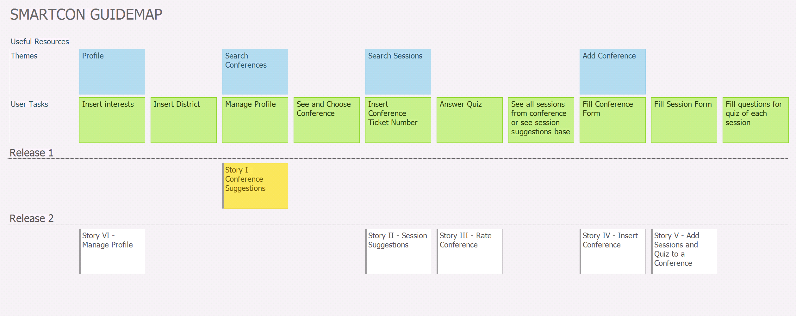


#### Story I - Conference Suggestions

* **Story**
As an Attendee, I want to be able to get conference suggestions based on my profile and availability so that the set of results is straightforward and accurate.

* **User interface mockups**.

  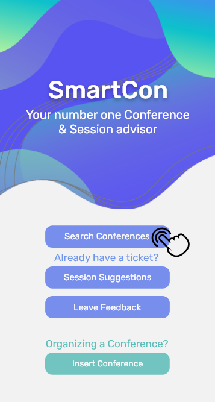&nbsp;&nbsp;&nbsp;&nbsp;&nbsp;&nbsp;&nbsp; 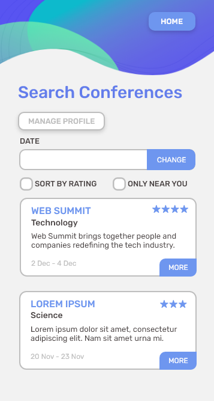

* **Acceptance tests**.
```gherkin
Scenario: Attendee searches conferences with profile preconfigured
  Given I have saved my Profile Preferences
  When I tap the Search Conferences button
  And I select a Date range
  Then I get Conference Suggestions according to Preferences and Date
  And I can sort these by Rating and Location.
```

```gherkin
Scenario: Attendee searches conferences without configuring profile
  Given I have not saved my Profile Preferences
  When I tap the Search Conferences button
  Then I will be prompted the Manage Profile form
```

* **Value and effort**.

  *Value*: Must have
  
  *Effort*: L

#### Story II - Session Suggestions

* **Story**.
As an Attendee, I want to have the possibility of getting the right session suggestions according to my knowledge level on the conference’s matter.

* **User interface mockups**.

  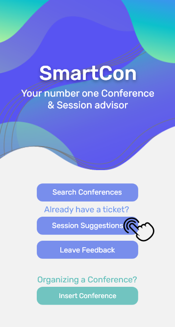&nbsp;&nbsp;&nbsp;&nbsp;&nbsp;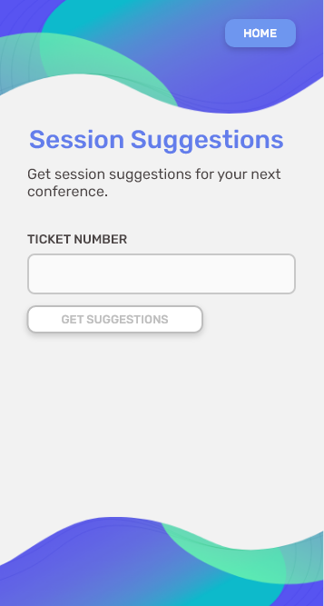&nbsp;&nbsp;&nbsp;&nbsp;&nbsp; 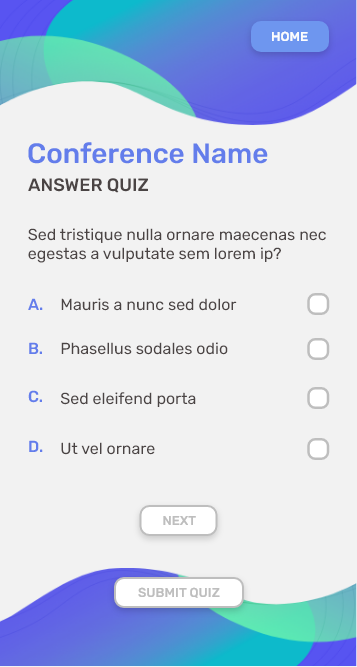&nbsp;&nbsp;&nbsp;&nbsp;&nbsp; 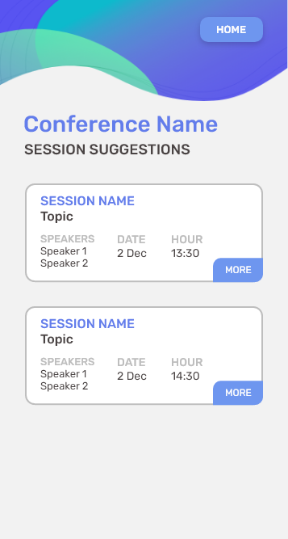


* **Acceptance tests**.
```gherkin
Scenario: Attendee searches session sugestions using a conference code never used before
  Given I have a valid Conference Code
  When I tap the Session Suggestions button
  And I insert the Conference Code
  Then I will be given the Quiz for the corresponding conference
  And I will get Session Suggestions according to my answers
```

```gherkin
Scenario: Attendee searches session sugestions using a conference code used before
  Given I have a valid Conference Code
  And I have already filled the Quiz for that Conference
  When I tap the Session Suggestions button
  And I insert the Conference Code
  Then I will get the previously obtained Session Suggestions
```

```gherkin
Scenario: Attendee searches session sugestions using an invalid conference code
  Given I have an invalid Conference Code
  When I tap the Session Suggestions button
  And I insert the Conference Code
  Then I will get a Warning alerting that the code is invalid
```

* **Value and effort**.

  *Value*: Must have
  
  *Effort*: XL


#### Story III - Rate Conference

* **Story**.
As an Attendee, I want to be able to rate a conference I attended to, to inform other people of my opinion on its quality and help other people when they are searching for conferences to attend to.

* **User interface mockups**. 

  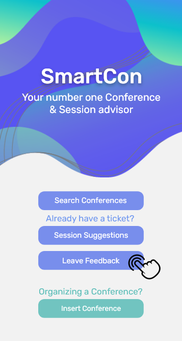&nbsp;&nbsp;&nbsp;&nbsp;&nbsp;&nbsp;&nbsp;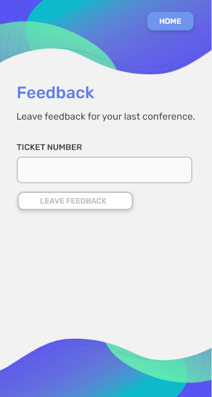&nbsp;&nbsp;&nbsp;&nbsp;&nbsp;&nbsp;&nbsp; 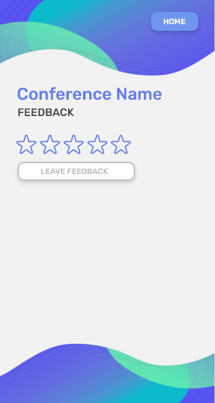


* **Acceptance tests**.
```gherkin
Scenario: Attendee rates a conference using a conference code
  Given I have a Conference Code
  When I tap the Leave Feedback button
  And I insert the Conference Code
  Then I will be able to choose the Rating for the conference
  And Leave Feedback
```

```gherkin
Scenario: Attendee rates a conference using an invalid conference code
  Given I have an invalid Conference Code
  When I tap the Leave Feedback button
  And I insert the Conference Code
  Then I will get a Warning alerting that the code is invalid
```

* **Value and effort**.
  *Value*: Could have
  
  *Effort*: M

#### Story IV - Insert Conference

* **Story**.
As a member of the Conference staff, I want to be able to insert a conference into the app database in order to promote it to possible attendees.

* **User interface mockups**.

  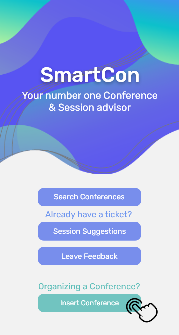&nbsp;&nbsp;&nbsp;&nbsp;&nbsp;&nbsp;&nbsp;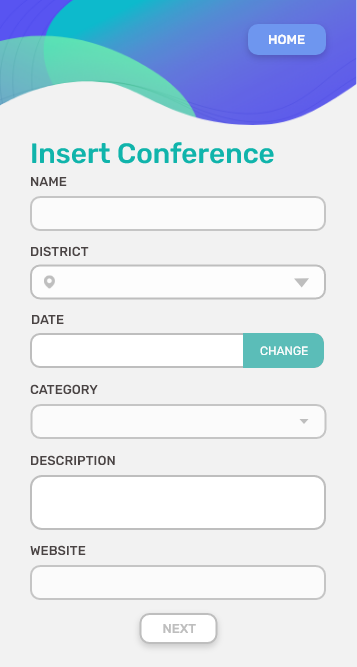

* **Acceptance tests**.
```gherkin
Scenario: Conference staff member inserts a conference into the app
  Given I have Signed In
  When I tap the Insert Conference button
  Then I will be able to fill a form with the Conference name, date and relevant data
  And I will be redirected to a form in order to Add Sessions and Quiz.
```

* **Value and effort**.
  *Value*: Could have
  
  *Effort*: L

#### Story V - Add Sessions and Quiz to a Conference

* **Story**.
As a member of the Conference staff, I want to be able to test the attendees’ knowledge in order to have an audience that is inquisitive and capable of understanding the matter discussed in each session. 

* **User interface mockups**.

  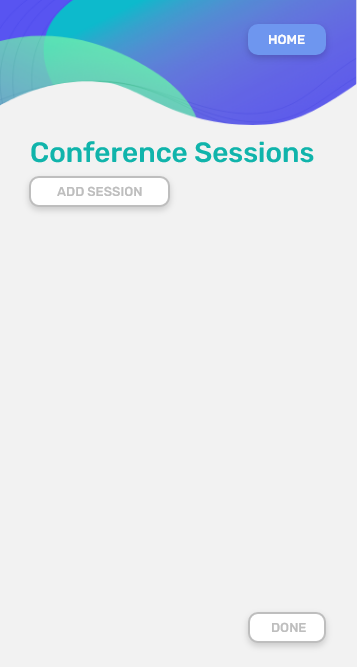&nbsp;&nbsp;&nbsp;&nbsp;&nbsp;&nbsp;&nbsp; 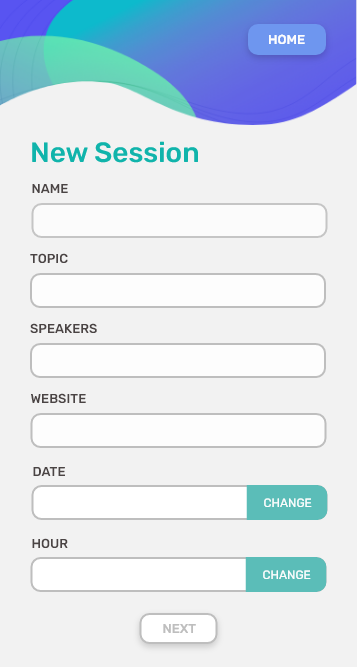&nbsp;&nbsp;&nbsp;&nbsp;&nbsp;&nbsp;&nbsp; 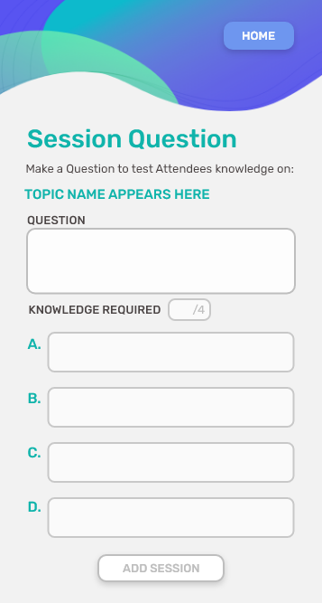

* **Acceptance tests**.
```gherkin
Scenario: Conference staff member inserts a session and respective question to its conference
  Given I have inserted a conference
  When I tap the Add Session button
  Then I will be able to fill a form with the Session name, topic and relevant data
  And add a question to the Quiz related to such Session
```

* **Value and effort**.
  *Value*: Must have
  
  *Effort*: XL
  
#### Story VI - Manage Profile

* **Story**.
As an Attendee, I want to be able to change my saved interests and desired location.

* **User interface mockups**.

  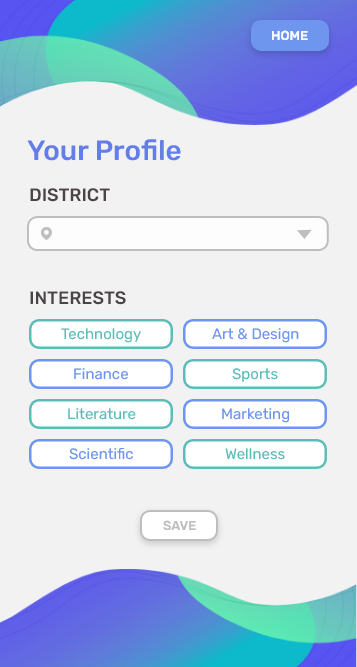

* **Acceptance tests**.
```gherkin
Scenario: Attendee changes his profile preferences or location
  Given I have Signed In
  And I have clicked the Session Suggestions button
  When I tap the Manage Profile button
  Then I will be able to change my Interests and District
```

```gherkin
Scenario: Attendee creates his profile preferences or location
  Given I have Signed In
  And I have not configured my profile yet
  When I click the Session Suggestions button
  Then I will be able to set my Interests and District
```

* **Value and effort**.
  *Value*: Must have
  
  *Effort*: L


### Domain model

To better understand the context of the software system, it is very useful to have a simple UML class diagram with all the key concepts (names, attributes) and relationships involved of the problem domain addressed by your module.

---

## Architecture and Design
 
The architecture of a software system encompasses the set of key decisions about its overall organization. 

A well written architecture document is brief but reduces the amount of time it takes new programmers to a project to understand the code to feel able to make modifications and enhancements.

To document the architecture requires describing the decomposition of the system in their parts (high-level components) and the key behaviors and collaborations between them. 

In this section you should start by briefly describing the overall components of the project and their interrelations. You should also describe how you solved typical problems you may have encountered, pointing to well-known architectural and design patterns, if applicable.

### Physical architecture

The purpose of this subsection is to document the high-level logical structure of the code, using a UML diagram with logical packages, without the worry of allocating to components, processes or machines.

It can be beneficial to present the system both in a horizontal or vertical decomposition:
* horizontal decomposition may define layers and implementation concepts, such as the user interface, business logic and concepts; 
* vertical decomposition can define a hierarchy of subsystems that cover all layers of implementation.

### Logical architecture

The goal of this subsection is to document the high-level physical structure of the software system (machines, connections, software components installed, and their dependencies) using UML deployment diagrams or component diagrams (separate or integrated), showing the physical structure of the system.

It should describe also the technologies considered and justify the selections made. Examples of technologies relevant for openCX are, for example, frameworks for mobile applications (Flutter vs ReactNative vs ...), languages to program with microbit, and communication with things (beacons, sensors, etc.).


### Prototype

To help on validating all the architectural, design and technological decisions made, we usually implement a vertical prototype, a thin vertical slice of the system.

In this subsection please describe in more detail which, and how, user(s) story(ies) were implemented.

---

## Implementation

### Product increment #1
Changelogs for the first increment can be found [here](https://github.com/FEUP-ESOF-2020-21/open-cx-t2g3-them-d/releases) - v0.1.0.

---

## Test


---

## Configuration and change management


---

## Project management


---

## Evolution - contributions to open-cx

