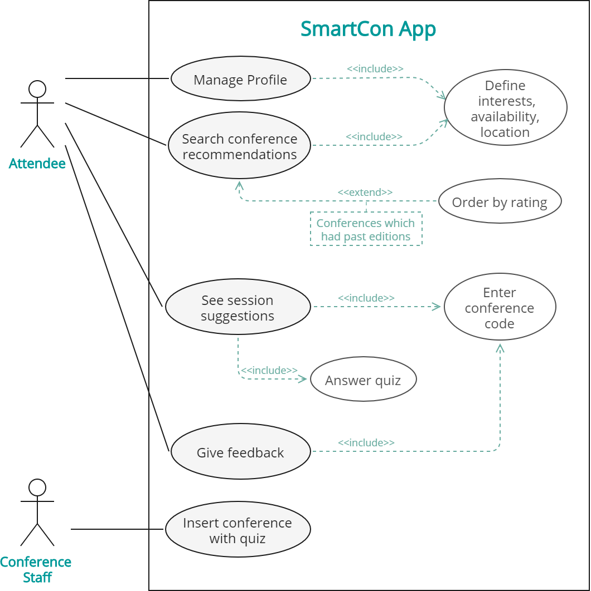

# openCX- 'THEM'D' Development Report

Welcome to the documentation pages of the SmartCon of **openCX**!

You can find here detailed about the SmartCon, hereby mentioned as module, from a high-level vision to low-level implementation decisions, a kind of Software Development Report, organized by discipline (as of RUP): 

* Business modeling 
  * [Product Vision](#Product-Vision)
  * [Elevator Pitch](#Elevator-Pitch)
* Requirements
  * [Use Case Diagram](#Use-case-diagram)
  * [User stories](#User-stories)
  * [Domain model](#Domain-model)
* Architecture and Design
  * [Physical architecture](#Physical-architecture)
  * [Logical architecture](#Logical-architecture)
  * [Prototype](#Prototype)
* [Implementation](#Implementation)
* [Test](#Test)
* [Configuration and change management](#Configuration-and-change-management)
* [Project management](#Project-management)

So far, contributions are exclusively made by the initial team, but we hope to open them to the community, in all areas and topics: requirements, technologies, development, experimentation, testing, etc.

Please contact us! 

Thank you!

* Diana Cristina Amaral de Freitas
* Henrique Manuel Ruivo Pereira
* Mariana Oliveira Ramos
* Tomás Freitas Gonçalves

---

## Product Vision

SmartCon is an app aimed at simplifying the process of choosing conferences, allowing its users to filter these by interest, location, availability and feedback to previous editions. Additionally, SmartCon takes into account the users’ knowledge level to suggest the most relevant sessions in a specific conference, using, for that purpose, a small quiz created by the conference organization.

---
## Elevator Pitch

---
## Requirements

### Use case diagram

#### Manage Profile
* **Actor**: Attendee
* **Description**: This use case exists so that the attendees can specify their interests, location and availability.  
* **Preconditions and Post conditions**: In order to choose a conference from a filtered set of conferences the attendees must previously define their profile by filling out a form when installing the app.
* **Normal Flow**: 
  1. The attendee enters his name
  2. The attendee selects his interest from a set of options
  3. The attendee selects his location from a set of options
  4. The attendee selects the date range
  5. The attendee clicks a button to save his profile.
* **Alternative Flows and Exceptions**: 

#### See conference recommendations
* **Actor**: Attendee
* **Description**: This use case exists so that the attendees can choose  which conference to go to from an already filtered set based on their interests, location, availability and feedback to previous editions.  
* **Preconditions and Post conditions**: In order to choose a conference from a filtered set of conferences the attendees must previously define their profile by filling out a form when installing the app.
* **Normal Flow**: 
  1. The attendee fills his profile 
  2. The attendee presses the button to see conference suggestions
* **Alternative Flows and Exceptions**: 

#### See session suggestions
* **Actor**: Attendee
* **Description**: This use case exists so that the attendees can see which sessions are most recommended based on their knowledge about the conference main topics.
* **Preconditions and Post conditions**: In order to see the set of filtered sessions the attendee must first enter the conference code which they have decided to attend. They must also answer the quiz provided by the conference organization.
* **Normal Flow**: 
  1. The attendee presses the button to insert the code of the chosen conference
  2. The attendee enters the code
  3. The attendee presses the button to see session suggestions
  4. The attendee answers the quiz made by the conference organization
  5. The attendee sees the suggestions
* **Alternative Flows and Exceptions**: 
  1. The attendee presses the button to insert the code of the chosen conference
  2. The attendee enters the code
  3. The attendee sees the suggestions that were previously obtained

#### Give feedback
* **Actor**: Attendee
* **Description**: This use case exists so that the attendees can rate a conference they attended.
* **Preconditions and Post conditions**: In order to rate a conference it must have already occurred.
* **Normal Flow**: 
  1. The attendee presses the button to insert the code of the chosen conference
  2. The attendee enters the code
  3. The attendee presses the button to rate the conference
  3. The attendee rates the conference
* **Alternative Flows and Exceptions**: 

#### Insert conference with quiz
* **Actor**: Conference Staff
* **Description**: This use case exists so that the conference staff can upload conferences into the database to later be presented to the attendees who will answer the quiz.
* **Preconditions and Post conditions**: In order to insert a new conference, the conference staff must first join the app. They must also choose a set of multiple choice questions whose answers will lead to a set of sessions.
* **Normal Flow**: 
  1. The conference staff presses the button to add a new conference to the app.
  2. The conference staff  types the conference information.
  3. The conference staff inserts a set of multiple choice questions
* **Alternative Flows and Exceptions**: 

### User stories

### Domain model

---

## Architecture and Design
 

### Physical architecture

### Logical architecture

### Prototype

---

## Test

---

## Configuration and change management

---

## Project management

---

## Evolution - contributions to open-cx

