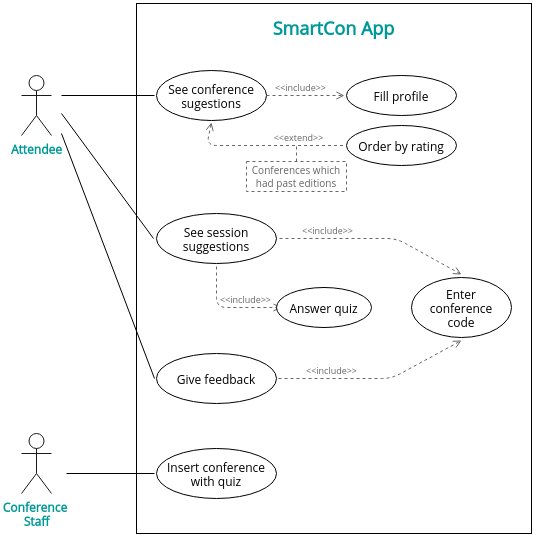

# openCX- 'THEM'D' Development Report

Welcome to the documentation pages of the SmartCon of **openCX**!

You can find here detailed about the SmartCon, hereby mentioned as module, from a high-level vision to low-level implementation decisions, a kind of Software Development Report, organized by discipline (as of RUP): 

* Business modeling 
  * [Product Vision](#Product-Vision)
  * [Elevator Pitch](#Elevator-Pitch)
* Requirements
  * [Use Case Diagram](#Use-case-diagram)
  * [User stories](#User-stories)
  * [Domain model](#Domain-model)
* Architecture and Design
  * [Physical architecture](#Physical-architecture)
  * [Logical architecture](#Logical-architecture)
  * [Prototype](#Prototype)
* [Implementation](#Implementation)
* [Test](#Test)
* [Configuration and change management](#Configuration-and-change-management)
* [Project management](#Project-management)

So far, contributions are exclusively made by the initial team, but we hope to open them to the community, in all areas and topics: requirements, technologies, development, experimentation, testing, etc.

Please contact us! 

Thank you!

* Diana Cristina Amaral de Freitas
* Henrique Manuel Ruivo Pereira
* Mariana Oliveira Ramos
* Tomás Freitas Gonçalves

---

## Product Vision

SmartCon is an app aimed at simplifying the process of choosing conferences, allowing its users to filter these by interest, location, availability and feedback to previous editions. Additionally, SmartCon takes into account the users’ knowledge level to suggest the most relevant sessions in a specific conference.

---
## Elevator Pitch

Draft a small text to help you quickly introduce and describe your product in a short time and a few words (~800 characters), a technique usually known as elevator pitch.

Take a look at the following links to learn some techniques:
* [Crafting an Elevator Pitch](https://www.mindtools.com/pages/article/elevator-pitch.htm)
* [The Best Elevator Pitch Examples, Templates, and Tactics - A Guide to Writing an Unforgettable Elevator Speech, by strategypeak.com](https://strategypeak.com/elevator-pitch-examples/)
* [Top 7 Killer Elevator Pitch Examples, by toggl.com](https://blog.toggl.com/elevator-pitch-examples/)

---
## Requirements

### Use case diagram

#### See conference suggestions
* **Actor**: Attendee
* **Description**: This use case exists so that the attendees can choose  which conference to go to from an already filtered set based on their interests, location, availability and feedback to previous editions.  
* **Preconditions and Post conditions**: In order to choose a conference from a filtered set of conferences the attendees must previously define their profile by filling out a form when installing the app.
* **Normal Flow**: 
  1. The attendee fills his profile 
  2. The attendee presses the button to see conference suggestions
* **Alternative Flows and Exceptions**: 

#### See session suggestions
* **Actor**: Attendee
* **Description**: This use case exists so that the attendees can see which sessions are most recommended based on their knowledge about the conference main topics.
* **Preconditions and Post conditions**: In order to see the set of filtered sessions the attendee must first enter the conference code which they have decided to attend. They must also answer the quiz proposed by chosen conference.
* **Normal Flow**: 
  1. The attendee presses the button to insert the code of the chosen conference
  2. The attendee enters the code
  3. The attendee presses the button to see session suggestions
  4. The attendee answers the quiz made by the conference
  5. The attendee sees the suggestions
* **Alternative Flows and Exceptions**: 

#### Answer Quiz
* **Actor**: Attendee
* **Description**: This use case exists so that the app can filter a set of sessions to suggest to the attendee.
* **Preconditions and Post conditions**:  In order to answer the quiz the attendee must first choose a conference and enter its code.
* **Normal Flow**: 
  1. The attendee enters the conference code
  2. The attendee answers the quiz selecting one of the options in each question
  3. The attendee presses the button when finished
* **Alternative Flows and Exceptions**: 

#### Give feedback
* **Actor**: Attendee
* **Description**: This use case exists so that the attendees can rate a conference they attended.
* **Preconditions and Post conditions**: In order to rate a conference it must have already occurred.
* **Normal Flow**: 
* **Alternative Flows and Exceptions**: 

#### Insert conference with quiz
* **Actor**: Conference Staff
* **Description**: This use case exists so that the conference staff can upload conferences into the database to later be presented to the attendees who will answer the quiz.
* **Preconditions and Post conditions**: In order to insert a new conference, the conference staff must first join the app. They must also choose a set of multiple choice questions whose answers will lead to a set of sessions.
* **Normal Flow**: 
  1. The conference staff presses the button to add a new conference to the app.
  2. The conference staff  types the conference information.
  3. The conference staff inserts a set of multiple choice questions
* **Alternative Flows and Exceptions**: 

### User stories

#### Story I

**Story**.
As an Attendee, I want to be able to get conference suggestions based on my interests, location and availability so that the set of results is straightforward and accurate.

**User interface mockups**.

**Acceptance tests**.
For each user story you should write also the acceptance tests (textually in Gherkin), i.e., a description of scenarios (situations) that will help to confirm that the system satisfies the requirements addressed by the user story.

**Value and effort**.
At the end, it is good to add a rough indication of the value of the user story to the customers (e.g. [MoSCoW](https://en.wikipedia.org/wiki/MoSCoW_method) method) and the team should add an estimation of the effort to implement it, for example, using t-shirt sizes (XS, S, M, L, XL).

#### Story II

**Story**.
As an Attendee, I want to be able to rate a conference I attended to, to inform other people of my opinion on its quality and help other people when they are searching for conferences to attend to.

**User interface mockups**.

**Acceptance tests**.
For each user story you should write also the acceptance tests (textually in Gherkin), i.e., a description of scenarios (situations) that will help to confirm that the system satisfies the requirements addressed by the user story.

**Value and effort**.
At the end, it is good to add a rough indication of the value of the user story to the customers (e.g. [MoSCoW](https://en.wikipedia.org/wiki/MoSCoW_method) method) and the team should add an estimation of the effort to implement it, for example, using t-shirt sizes (XS, S, M, L, XL).

#### Story III

**Story**.
As an Attendee, I want to have the possibility of getting the right session suggestions according to my knowledge level on the conference’s matter.

**User interface mockups**.

**Acceptance tests**.
For each user story you should write also the acceptance tests (textually in Gherkin), i.e., a description of scenarios (situations) that will help to confirm that the system satisfies the requirements addressed by the user story.

**Value and effort**.
At the end, it is good to add a rough indication of the value of the user story to the customers (e.g. [MoSCoW](https://en.wikipedia.org/wiki/MoSCoW_method) method) and the team should add an estimation of the effort to implement it, for example, using t-shirt sizes (XS, S, M, L, XL).

#### Story IV

**Story**.
As a member of the Conference staff, I want to be able to insert a conference into the app database in order to promote it to possible attendees.

**User interface mockups**.

**Acceptance tests**.
For each user story you should write also the acceptance tests (textually in Gherkin), i.e., a description of scenarios (situations) that will help to confirm that the system satisfies the requirements addressed by the user story.

**Value and effort**.
At the end, it is good to add a rough indication of the value of the user story to the customers (e.g. [MoSCoW](https://en.wikipedia.org/wiki/MoSCoW_method) method) and the team should add an estimation of the effort to implement it, for example, using t-shirt sizes (XS, S, M, L, XL).

#### Story V

**Story**.
As a member of the Conference staff, I want to be able to test the attendees’ knowledge in order to have an audience that is inquisitive and capable of understanding the matter discussed in each session. 

**User interface mockups**.

**Acceptance tests**.
For each user story you should write also the acceptance tests (textually in Gherkin), i.e., a description of scenarios (situations) that will help to confirm that the system satisfies the requirements addressed by the user story.

**Value and effort**.
At the end, it is good to add a rough indication of the value of the user story to the customers (e.g. [MoSCoW](https://en.wikipedia.org/wiki/MoSCoW_method) method) and the team should add an estimation of the effort to implement it, for example, using t-shirt sizes (XS, S, M, L, XL).

### Domain model

To better understand the context of the software system, it is very useful to have a simple UML class diagram with all the key concepts (names, attributes) and relationships involved of the problem domain addressed by your module.

---

## Architecture and Design
 
The architecture of a software system encompasses the set of key decisions about its overall organization. 

A well written architecture document is brief but reduces the amount of time it takes new programmers to a project to understand the code to feel able to make modifications and enhancements.

To document the architecture requires describing the decomposition of the system in their parts (high-level components) and the key behaviors and collaborations between them. 

In this section you should start by briefly describing the overall components of the project and their interrelations. You should also describe how you solved typical problems you may have encountered, pointing to well-known architectural and design patterns, if applicable.

### Physical architecture

The purpose of this subsection is to document the high-level logical structure of the code, using a UML diagram with logical packages, without the worry of allocating to components, processes or machines.

It can be beneficial to present the system both in a horizontal or vertical decomposition:
* horizontal decomposition may define layers and implementation concepts, such as the user interface, business logic and concepts; 
* vertical decomposition can define a hierarchy of subsystems that cover all layers of implementation.

### Logical architecture

The goal of this subsection is to document the high-level physical structure of the software system (machines, connections, software components installed, and their dependencies) using UML deployment diagrams or component diagrams (separate or integrated), showing the physical structure of the system.

It should describe also the technologies considered and justify the selections made. Examples of technologies relevant for openCX are, for example, frameworks for mobile applications (Flutter vs ReactNative vs ...), languages to program with microbit, and communication with things (beacons, sensors, etc.).

### Prototype

To help on validating all the architectural, design and technological decisions made, we usually implement a vertical prototype, a thin vertical slice of the system.

In this subsection please describe in more detail which, and how, user(s) story(ies) were implemented.
---

## Test

---

## Configuration and change management

---

## Project management

---

## Evolution - contributions to open-cx

